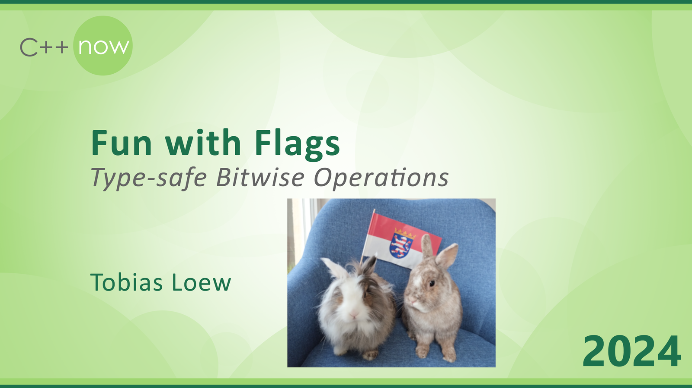

---

marp: true
enableHtml: true
__theme: gaia
class: invert
paginate: true
_paginate: false
math: mathjax

---

<!-- 

<link rel="stylesheet" type="text/css" href="https://tikzjax.com/v1/fonts.css">
 -->

<!--  -->

<!-- 

 -->

<!--  -->

<!-- 

me!

 -->

<!-- 
<h2>come and hop with me!</h2>
 -->

---
<!--header: 'outline'-->

# Outline

- Using bits for Boolean options

* Builtin bitwise operators

* The Complement-Problem

* Boost.Flags Library

* Other Approaches 

---
<!--header: 'Using bits for Boolean options'-->

# Using bits for Boolean options

---
<!--header: 'Using bits for Boolean options'-->

## Easy to define, e.g. as macros, integer constants or enumerators
* <pre><code>
#define&nbsp;OPTION_ONE&nbsp;&nbsp;&nbsp;0x1
  #define&nbsp;OPTION_TWO&nbsp;&nbsp;&nbsp;0x2
  #define&nbsp;OPTION_THREE&nbsp;0x4
</code></pre>

* <pre><code>
static&nbsp;constexpr&nbsp;int&nbsp;option_one&nbsp;&nbsp;&nbsp;=&nbsp;0x1;
  static&nbsp;constexpr&nbsp;int&nbsp;option_two&nbsp;&nbsp;&nbsp;=&nbsp;0x2;
  static&nbsp;constexpr&nbsp;int&nbsp;option_three&nbsp;=&nbsp;0x4;
</code></pre>

* <pre><code>
enum&nbsp;options_enum&nbsp;{
  &nbsp;&nbsp;&nbsp;&nbsp;option_one  &nbsp;=&nbsp;0x1,
  &nbsp;&nbsp;&nbsp;&nbsp;option_two  &nbsp;=&nbsp;0x2,
  &nbsp;&nbsp;&nbsp;&nbsp;option_three&nbsp;=&nbsp;0x4
  };
</code></pre>
---

<!--header: 'Using bits for Boolean options'-->

## Compact representation in memory

  * `int` can hold up to 16 / 32 different Boolean options 
    

    

    
b0

    
b1

    
b2

    
b3

    
b4

    ...
    
b28

    
b29

    
b30

    
b31

    <!-- 
b4

    ... 
    
b31
 -->
    

    
 

  * Simple & efficient bulk transfer in interfaces

  * Compressed version of a `std::array<bool, 32>`

---

<!--header: 'Using bits for Boolean options'-->

##  Enforces the usage of names / prevent bool parameters

* Declaration
  <pre><code>
void&nbsp;foo(bool&nbsp;use_opt1,&nbsp;bool&nbsp;use_opt2,&nbsp;bool&nbsp;use_opt3);
  
  void&nbsp;foo(options_enum&nbsp;options);
</code></pre> 

* Call site
  <pre><code>
foo(true,&nbsp;false,&nbsp;true);
  
  foo(option_one&nbsp;|&nbsp;option_three);
</code></pre>

---

<!--header: 'Using bits for Boolean options'-->

## Builtin support through bitwise operators

* <pre><code>
bitwise AND: int&nbsp;operator&amp;(int,&nbsp;int)         int&amp;&nbsp;operator&amp;=(int&amp;,&nbsp;int)
</code></pre>
* <pre><code>
bitwise OR:  int&nbsp;operator|(int,&nbsp;int)         int&amp;&nbsp;operator|=(int&amp;,&nbsp;int)
</code></pre>
* <pre><code>
bitwise XOR: int&nbsp;operator^(int,&nbsp;int)         int&amp;&nbsp;operator^=(int&amp;,&nbsp;int)
</code></pre>
* <pre><code>
bitwise Negation: int&nbsp;operator~(int)
</code></pre>

---

# Everything good!

---

# Everything good! - Really?

<!-- ---

header: 'Using bits for Boolean options'

## Why do we use the bits of integer types for Boolean options?

* Easy to define, e.g. as macros, integer constants or enumerators

* Compact representation in memory

* Simple & Efficient bulk transfer in interfaces
  - `unsigned int` can hold up to 16 / 32 different Boolean options

* Enforces the usage of names / prevent bool parameters in interfaces
  >    "Boolean arguments loudly declare that the function does more than one thing. They are confusing and should be eliminated."
  > C. Martin (Uncle Bob), Clean Code

* Language support for setting and querying through bitwise operators -->

<!-- --- -->
<!--header: 'Using bits for Boolean options'-->

<!-- # Bitwise operators in action ... -->

  <!-- <ul style="list-style: none;padding-left: 0;">
    <li data-marpit-fragment="1">
<pre><code>
/*&nbsp;Listbox&nbsp;Styles&nbsp;*/
#define&nbsp;LBS_NOTIFY&nbsp;&nbsp;&nbsp;&nbsp;&nbsp;&nbsp;&nbsp;&nbsp;&nbsp;&nbsp;&nbsp;&nbsp;0x0001L
#define&nbsp;LBS_SORT&nbsp;&nbsp;&nbsp;&nbsp;&nbsp;&nbsp;&nbsp;&nbsp;&nbsp;&nbsp;&nbsp;&nbsp;&nbsp;&nbsp;0x0002L
#define&nbsp;LBS_NOREDRAW&nbsp;&nbsp;&nbsp;&nbsp;&nbsp;&nbsp;&nbsp;&nbsp;&nbsp;&nbsp;0x0004L
#define&nbsp;LBS_MULTIPLESEL&nbsp;&nbsp;&nbsp;&nbsp;&nbsp;&nbsp;&nbsp;0x0008L
</code></pre>   </li>
    <li data-marpit-fragment="2">
<pre><code>
//&nbsp;basic&nbsp;list-box&nbsp;options:&nbsp;sorting,&nbsp;notification
unsigned&nbsp;int&nbsp;opts&nbsp;=&nbsp;LBS_SORT&nbsp;|&nbsp;LBS_NOTIFY;
&nbsp;
//&nbsp;add&nbsp;multi-selection
opts&nbsp;|=&nbsp;LBS_MULTIPLESEL;
&nbsp;
//&nbsp;remove&nbsp;sorting
opts&nbsp;&amp;=&nbsp;~LBS_SORT;
&nbsp;
//&nbsp;notifications&nbsp;wanted?
if&nbsp;(opts&nbsp;&amp;&nbsp;LBS_NOTIFY)&nbsp;{&nbsp;...&nbsp;}

</code></pre>
</li>
</ul> -->
 

<!--

The Return Type may depend on the number of arguments

-->
---
<!--header: 'Using bits for Boolean options'-->

# Bitwise operators in action ...

* integer types
  - all operators supported
  - no type-safety at all

* unscoped enums
  - all except assignment operators supported by implicit integer promotion
  - no type-safety for bitwise ops, `static_cast` to enum required

* scoped enums
  - no operator supported
  - `static_cast` to underlying and back to enum required

---
<!--header: 'Don&apos;t lose your head!'-->

# A short fairy-tale

* <h2>The Fun in this talk</h2>

---
<!--header: 'Don&apos;t lose your head!'-->

# Once upon a time...

---
<!--header: 'Don&apos;t lose your head!'-->

https://de.freepik.com/

---
<!--header: 'Don&apos;t lose your head!'-->

https://disney.fandom.com/

---
<!--header: 'Don&apos;t lose your head!'-->

https://upload.wikimedia.org/wikipedia/commons/c/c4/Iron_Rule.jpg

---
<!--header: 'Don&apos;t lose your head!'-->

<table class="hop_experts">
<td class="hop_experts_td" >

<h1 style="font-size:250%"> The Dayly Queen </h1>

<table class="hop_experts">
<tr style="border: none">

<td class="hop_experts_td" style="width:250px">

</td>

<td class="hop_experts_td" >

Proclamation: Lorem ipsum dolor sit amet, <i><u> The Queen</u></i>! 
Proclamation: At vero eos et accusam, <i><u> The Queen</u></i>! 
Proclamation: Stet clita kasd gubergren, <i><u> The Queen</u></i>! 
Proclamation: Duis autem vel eum, <i><u> The Queen</u></i>! 
Proclamation: Nam liber tempor cum soluta, <i><u> The Queen</u></i>! 
Proclamation: Ut wisi enim ad minim veniam, <i><u> The Queen</u></i>!

</td>

</tr>
</table>

</td>
</table>

---
<!--header: 'Don&apos;t lose your head!'-->

<table class="hop_experts">
<td class="hop_experts_td" >

<h1 style="font-size:250%"> The Dayly Queen </h1>

<table class="hop_experts">
<tr style="border: none">

<td class="hop_experts_td" style="width:250px">

</td>

<td class="hop_experts_td" >

Proclamation: Lorem ipsum dolor sit amet, <i><u> The Queen</u></i>! 
Proclamation: At vero eos et accusam, <i><u> The Queen</u></i>! 
Proclamation: Stet clita kasd gubergren, <i><u> The Queen</u></i>! 
Proclamation: Duis autem vel eum, <i><u> The Queen</u></i>! 
Proclamation: Nam liber tempor cum soluta, <i><u> The Queen</u></i>! 
Proclamation: Ut wisi enim ad minim veniam, <i><u> The Queen</u></i>!

</td>

</tr>
</table>

</td>
</table>

---
<!--header: 'Don&apos;t lose your head!'-->

<table class="hop_experts">
<td class="hop_experts_td" >

<h1 style="font-size:250%"> The Dayly Queen </h1>

<table class="hop_experts">
<tr style="border: none">

<td class="hop_experts_td" style="width:250px">

</td>

<td class="hop_experts_td" >

Proclamation:

All proclamations shall be encoded in C++,  <i><u> The Queen</u></i>! 

</td>

</tr>
</table>

</td>
</table>

---

<pre><code>
enum&nbsp;font_styles&nbsp;:&nbsp;unsigned&nbsp;int&nbsp;{
&nbsp;&nbsp;&nbsp;&nbsp;bold&nbsp;=&nbsp;1,
&nbsp;&nbsp;&nbsp;&nbsp;italic&nbsp;=&nbsp;2,
&nbsp;&nbsp;&nbsp;&nbsp;underline&nbsp;=&nbsp;4
};

</code></pre>

---

<pre><code>
enum&nbsp;font_styles&nbsp;:&nbsp;unsigned&nbsp;int&nbsp;{
&nbsp;&nbsp;&nbsp;&nbsp;bold&nbsp;=&nbsp;1,
&nbsp;&nbsp;&nbsp;&nbsp;italic&nbsp;=&nbsp;2,
&nbsp;&nbsp;&nbsp;&nbsp;underline&nbsp;=&nbsp;4
};

//&nbsp;special&nbsp;style&nbsp;for&nbsp;the&nbsp;Queen&#39;s&nbsp;name
static&nbsp;constexpr&nbsp;auto&nbsp;queen_of_hearts_name&nbsp;=&nbsp;italic&nbsp;|&nbsp;
                                             underline;
</code></pre>

---

<pre><code>
queen_of_hearts_name queen_of_hearts_name queen_of_hearts_name queen_of_hearts_name
queen_of_hearts_name queen_of_hearts_name queen_of_hearts_name queen_of_hearts_name

</code></pre>

<pre><code>
queen_of_hearts_name queen_of_hearts_name queen_of_hearts_name queen_of_hearts_name
queen_of_hearts_name queen_of_hearts_name queen_of_hearts_name queen_of_hearts_name

</code></pre>

---

<pre><code>
queen_of_hearts_name queen_of_hearts_name queen_of_hearts_name queen_of_hearts_name
queen_of_hearts_name queen_of_hearts_name queen_of_hearts_name queen_of_hearts_name

</code></pre>

<pre><code>
queen_of_hearts_name queen_of_hearts_name queen_of_hearts_name queen_of_hearts_name
queen_of_hearts_name queen_of_hearts_name queen_of_hearts_name queen_of_hearts_name

</code></pre>

---

<ul style="list-style: none;padding-left: 0;">
    <li>
<pre><code>
          queen_of_hearts_name           

</code></pre>
</li>
    <li data-marpit-fragment="1">
<pre><code>
                  -->

</code></pre>
</li>
    <li data-marpit-fragment="2">
<pre><code>
                 ~bold

</code></pre>
</li>
</ul>

---

<!--header: 'Don&apos;t lose your head!'-->

Microsoft Copilot

---

<!--header: 'Don&apos;t lose your head!'-->

https://disney.fandom.com/

---

<!--header: 'Don&apos;t lose your head!'-->

<pre><code>
enum&nbsp;font_styles&nbsp;:&nbsp;unsigned&nbsp;int&nbsp;{
&nbsp;&nbsp;&nbsp;&nbsp;bold&nbsp;=&nbsp;1,
&nbsp;&nbsp;&nbsp;&nbsp;italic&nbsp;=&nbsp;2,
&nbsp;&nbsp;&nbsp;&nbsp;underline&nbsp;=&nbsp;4,
&nbsp;&nbsp;&nbsp;&nbsp;strikeout&nbsp;=&nbsp;8&nbsp;&nbsp;&nbsp;//&nbsp;for&nbsp;Alice&#39;s&nbsp;name
};
</code></pre>

---
<!--header: 'Don&apos;t lose your head!'-->

<table class="hop_experts">
<td class="hop_experts_td" >

<h1 style="font-size:250%"> The Dayly Queen </h1>

<table class="hop_experts">
<tr style="border: none">

<td class="hop_experts_td" style="width:250px">

</td>

<td class="hop_experts_td" >

Proclamation:

 All persons whose names are stricken out are enemies of the kingdom,  &nbsp;  

</td>

</tr>
</table>

</td>
</table>

---
<!--header: 'Don&apos;t lose your head!'-->

<table class="hop_experts">
<td class="hop_experts_td" >

<h1 style="font-size:250%"> The Dayly Queen </h1>

<table class="hop_experts">
<tr style="border: none">

<td class="hop_experts_td" style="width:250px">

</td>

<td class="hop_experts_td" >

Proclamation:

All persons whose name is stricken out are enemies of the kingdom,  &nbsp;  

</td>

</tr>
</table>

</td>
</table>

---
<!--header: 'Don&apos;t lose your head!'-->

<table class="hop_experts">
<td class="hop_experts_td" >

<h1 style="font-size:250%"> The Dayly Queen </h1>

<table class="hop_experts">
<tr style="border: none">

<td class="hop_experts_td" style="width:250px">

</td>

<td class="hop_experts_td" >

Proclamation:

All persons whose name is stricken out are enemies of the kingdom,  <s><i><u> The Queen</u></i></s>! 

</td>

</tr>
</table>

</td>
</table>

---

<!--header: 'Don&apos;t lose your head!'-->

Microsoft Copilot

---

<!--header: 'Don&apos;t lose your head!'-->

https://disney.fandom.com/

---
<!--header: 'Don&apos;t lose your head!'-->

<h1 style="font-size:500%"> The End </h1>

---
<!--header: 'Don&apos;t lose your head!'-->

# Moral:

<pre><code>
queen_of_hearts_name&nbsp;!=&nbsp;~bold
</code></pre>

* Syntactical
  <pre><code>
std::to_underlying(queen_of_hearts_name)&nbsp;!=&nbsp;std::to_underlying(~bold)
</code></pre>

* Semantical
  * `~bold` is not a set of font-modifications
  * Excludes boldness from a given set of flags
  

---
<!--header: 'Complement'-->

    
b

    
i

    
u

    
s

    
b4 ... b31

    <!-- 
b4

... 

b31
 -->

 
 

<code>disjuction (|)</code>

<!--   -->

<code>dims: #flags     &nbsp;&nbsp;   + 1</code>

 

    
b

    
i

    
u

    
s

    
b4 ... b31

    <!-- 
b4

...

b31

 -->
&nbsp;&nbsp;&nbsp;&nbsp;&nbsp;&nbsp; <code class="op_cpmpl"><--  ~  --></code>  &nbsp;&nbsp;&nbsp;&nbsp; &nbsp;&nbsp; 

    
b

    
i

    
u

    
s

    
b4 ... b31

    <!-- 
b4

...

b31

 -->

  

<code class="bits_lhs">italic | underline</code><code style="visibility:hidden">                               </code><code class="bits_rhs strikeout_rhs2" style="justify-content: right;">!= </code><code class="bits_rhs NOPE_strikeout_rhs2__not" style="justify-content: right;">bold</code>

 

<code>conjuction (&)</code>

 
 

    
b

    
i

    
u

    
s

    
b4 ... b31

    <!-- 
b4

...

b31

 -->

 

 

 

 

 

 

 

 

 

 

 

 

---

    
b

    
i

    
u

    
s

    
b4 ... b31

<code>#flags: 4</code>
<code>#bit underlying type U: 32</code>

* Underlying type $U$ with `~, &, |`: _(bitcount of $U$)_-dim Boolean algebra 

* <code>flags</code> with `&, |` form a substructure $F$ with dimension `#flags`
  * in general *is not closed under bitwise negation `~`*.

* Closure $\overline{F}$ wrt. $\sim$
  * dimension `#flags + 1`, Boolean subalgebra of $U$

---

    
b

    
i

    
u

    
s

    
b4 ... b31

 

- Elements of  $\overline{F} \setminus F$ :  negative flag-masks 
  

  

    
b0

    
b1

    
b2

    
b3

    
b4 ... b31

  

  

  
  * put into different Type  

* For given enumeration `E`
  - Type for flags: `E` 
  - Type for negative flag-masks: `complement<E>`

* Meta-level: type-set `{E, complement<E>}` with `∼`, `&` and `∣` is a Boolean algebra 

---

<!--header: 'Complement & underlying type'-->

<pre><code>
enum&nbsp;flags&nbsp;{
&nbsp;&nbsp;&nbsp;&nbsp;flag_0&nbsp;=&nbsp;0x1,
&nbsp;&nbsp;&nbsp;&nbsp;flag_1&nbsp;=&nbsp;0x2
};
inline&nbsp;flags&nbsp;operator~&nbsp;(flags&nbsp;x)&nbsp;{
&nbsp;&nbsp;&nbsp;&nbsp;return&nbsp;static_cast&lt;flags&gt;(~static_cast&lt;int&gt;(x));
}
//&nbsp;other&nbsp;operators&nbsp;...
void&nbsp;foo()&nbsp;{
&nbsp;&nbsp;&nbsp;&nbsp;flags&nbsp;f&nbsp;=&nbsp;flag_0&nbsp;|&nbsp;flag_1;
&nbsp;&nbsp;&nbsp;&nbsp;flags&nbsp;mask&nbsp;=&nbsp;~flag_1;
&nbsp;&nbsp;&nbsp;&nbsp;f&nbsp;=&nbsp;f&nbsp;&amp;&nbsp;mask;
}

</code></pre>

---

<!--header: 'Complement & underlying type'-->

<pre><code>
enum&nbsp;flags&nbsp;{
&nbsp;&nbsp;&nbsp;&nbsp;flag_0&nbsp;=&nbsp;0x1,
&nbsp;&nbsp;&nbsp;&nbsp;flag_1&nbsp;=&nbsp;0x2
};
inline&nbsp;flags&nbsp;operator~&nbsp;(flags&nbsp;x)&nbsp;{
&nbsp;&nbsp;&nbsp;&nbsp;return&nbsp;static_cast&lt;flags&gt;(~static_cast&lt;int&gt;(x));
}
//&nbsp;other&nbsp;operators&nbsp;...
void&nbsp;foo()&nbsp;{
&nbsp;&nbsp;&nbsp;&nbsp;flags&nbsp;f&nbsp;=&nbsp;flag_0&nbsp;|&nbsp;flag_1;
&nbsp;&nbsp;&nbsp;&nbsp;flags&nbsp;mask&nbsp;=&nbsp;~flag_1;
&nbsp;&nbsp;&nbsp;&nbsp;f&nbsp;=&nbsp;f&nbsp;&amp;&nbsp;mask;
}

</code></pre>

* unscoped enum w/o explicit underlying type: two types inferred:
  * `underlying_type`
  * hypothetical integer value type with minimal width such that all enumerators can be represented -> defining the valid value-range
<!-- * explicit underlying type / `class` required to prevent UB -->
* `complement<flags>` uses `underlying_type_t<flags>` for value

---
<!--header: 'Boost.Flags'-->

# Design Rationale of Boost.Flags

* type-safety
  * enforce compatible types for binary operators
  * `complement` for `operator~`

* non-intrusive

* zero-overhead in optimized builds

* everything is `constexpr`

* operators are found by ADL

* at least C++11, use newer features if available

<!-- ---
<!--header: 'Boost.Flags'

# Boost.Flags: life example...

comparing with `BOOST_BITMASK` -->

---
<!--header: 'Boost.Flags'-->

# Boost.Flags: life example...

https://godbolt.org/z/5ffq6eGaW

---
<!--header: 'Orders'-->

# Orders on flags-enumerations

* induced by `<` on underlying integer type
  * total order
  * depends on enumerator-values
  * Syntax: used for sorting, sorted containers
* induced by entailment of flags
  * `a < b`  <=>  "flags in a" $\subset$ "flags in b"
  * partial order
  * independent of enumerator-values
  * Semantics

---

* sorted containers / algorithms require total order
  * `BOOST_FLAGS_SPECIALIZE_STD_LESS(E)` for sorted containers / std::algorithms
  * NOT working with `std::ranges`: calling `operator <`

* enums abstract away underlying values
  * program logic should not depend on underlying values

* `BOOST_FLAGS_DELETE_REL(E)` deletes all relational operators

* constexpr objects `total_order`, `partial_order`

* functions for partial-order comparison: `subset`, `subseteq`, `intersect`, `disjoint`

---

# Boost.Flags: additional features

* `make_null`, `make_if`
* `modify`, `modify_inplace`
* `add_if`, `add_if_inplace`
* `remove_if`, `remove_if_inplace`
* `get_underlying`, `from_underlying`

* Flags-generator: 
  * `flags_from_to(first, last)` iterates over all flags from `[first, ..., last]` 
  * `flags_to(last)` iterates over all flags from `[1, ..., last]` 

---
<!--header: 'Boost.Flags'-->

# Boost.Flags: applying to existing code-bases

* change macro / integer constants to enums
* opt-in by with `BOOST_FLAGS_ENABLE(E)`
* use scoped enums, `using enum E;`
* change interfaces from integer-types to enums
* minor adjustments:
  * <pre><code>
if&nbsp;(flags&nbsp;&amp;&nbsp;LBS_NOTIFY)&nbsp;{...}&nbsp;&nbsp;&nbsp;//&nbsp;scoped&nbsp;enum&nbsp;-&gt;&nbsp;bool
</code></pre>
  * <pre><code>
(cond&nbsp;?&nbsp;LBS_NOTIFY&nbsp;:&nbsp;0)
</code></pre>
    <pre><code>
boost::flags::make_if(LBS_NOTIFY,&nbsp;cond)
</code></pre>
* also works with enums in classes: `BOOST_FLAGS_ENABLE_LOCAL(E)`

---

# Boost.Flags: in real code

* EBSILON&reg;Professional: 122 uses of `BOOST_FLAGS_ENABLE...`

* Clang source code: enabled 16 enums - no errors detected

* Github-repo: tests run on a large matrix:
  * linux, windows, mac
  * clang (3.9 - 17), gcc (4.8-13), msvc (v140 - v143)
  * C++11 - C++23

---

# Some other available Flags libraries

| type-safe bin-ops| QFlags | foonathan  | BOOST_BITMASK  | .net |
|------------------|:------:|:----------:|:--------------:|:----:|
| &nbsp; | 
| &nbsp; | 
| &nbsp; | 
| &nbsp; | 
| &nbsp; | 
| &nbsp; | 

---

# Some other available Flags libraries

| type-safe bin-ops| QFlags | foonathan  | BOOST_BITMASK  | .net |
|------------------|:------:|:----------:|:--------------:|:----:|
| non-intrusive    | -      | -          |  +             | +    |
| &nbsp; | 
| &nbsp; | 
| &nbsp; | 
| &nbsp; | 
| &nbsp; | 

---

# Some other available Flags libraries

| type-safe bin-ops| QFlags | foonathan  | BOOST_BITMASK  | .net |
|------------------|:------:|:----------:|:--------------:|:----:|
| non-intrusive    | -      | -          |  +             | +    |
| zero-overhead    | -      | +          |  +             | +    |
| &nbsp; | 
| &nbsp; | 
| &nbsp; | 
| &nbsp; | 

---

# Some other available Flags libraries

| type-safe bin-ops| QFlags | foonathan  | BOOST_BITMASK  | .net |
|------------------|:------:|:----------:|:--------------:|:----:|
| non-intrusive    | -      | -          |  +             | +    |
| zero-overhead    | -      | +          |  +             | +    |
| `constexpr`      | -      | +/-        |  +/-           | N/A  |
| &nbsp; | 
| &nbsp; | 
| &nbsp; | 

---

# Some other available Flags libraries

| type-safe bin-ops| QFlags | foonathan  | BOOST_BITMASK  | .net |
|------------------|:------:|:----------:|:--------------:|:----:|
| non-intrusive    | -      | -          |  +             | +    |
| zero-overhead    | -      | +          |  +             | +    |
| `constexpr`      | -      | +/-        |  +/-           | N/A  |
| type-safe bin-ops| -      | +          |  -             | +    |
| &nbsp; | 
| &nbsp; | 

---

# Some other available Flags libraries

| type-safe bin-ops| QFlags | foonathan  | BOOST_BITMASK  | .net |
|------------------|:------:|:----------:|:--------------:|:----:|
| non-intrusive    | -      | -          |  +             | +    |
| zero-overhead    | -      | +          |  +             | +    |
| `constexpr`      | -      | +/-        |  +/-           | N/A  |
| type-safe bin-ops| -      | +          |  -             | +    |
| large underlying_t| -     | +          |  -             | +    |
| &nbsp; | 

---

# Some other available Flags libraries

| type-safe bin-ops| QFlags | foonathan  | BOOST_BITMASK  | .net |
|------------------|:------:|:----------:|:--------------:|:----:|
| non-intrusive    | -      | -          |  +             | +    |
| zero-overhead    | -      | +          |  +             | +    |
| `constexpr`      | -      | +/-        |  +/-           | N/A  |
| type-safe bin-ops| -      | +          |  -             | +    |
| large underlying_t| -     | +          |  -             | +    |
| `complement`     | -      | +          |  -             | -    |

<!-- ---

<!--header: 'the hop-experts'-- >

# this poll is presented to you by the hop-experts

<table class="hop_experts">
<tr style="border: none">
<td class="hop_experts_td" style="text-align:right; ">

# Luna

</td>

<td class="hop_experts_td" style="width:580px">

</td>

<td class="hop_experts_td" >

# Rolf

</td>

</tr>
</table>

 -->

---

<!--header: 'hopping on'-->

# Code & Documentation:

<h1> <a href="https://github.com/tobias-loew/flags">github.com/tobias-loew/flags</a> </h1>
  

---

<!-- 
    .vsselected{background-color:#264f78;border-style: solid;border-width: 1px;border-color:#889bad}
 -->

# questions / remarks?

